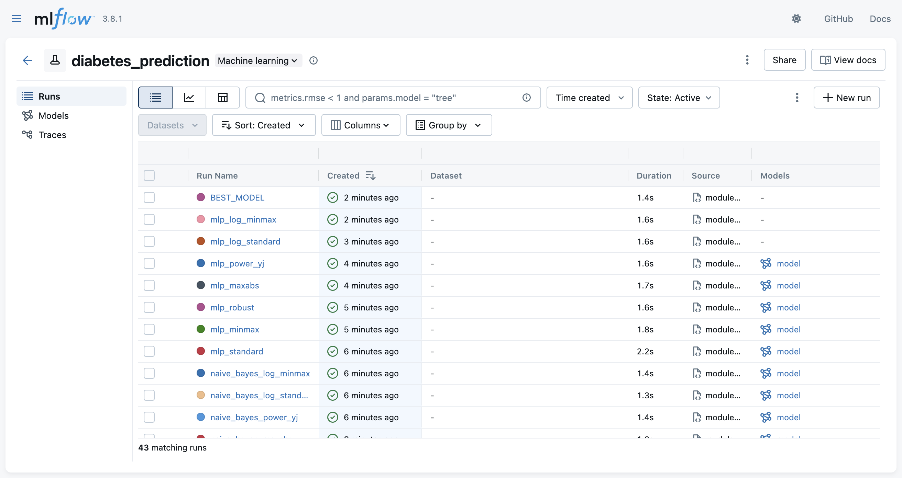
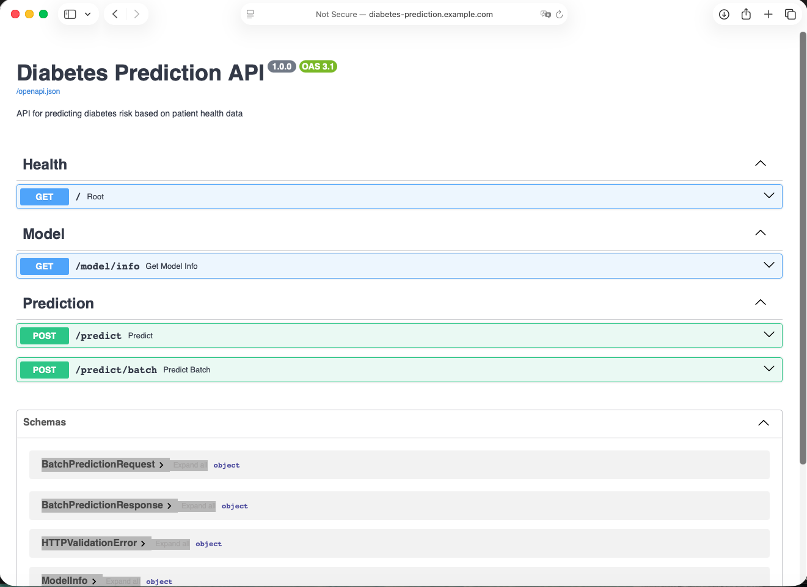
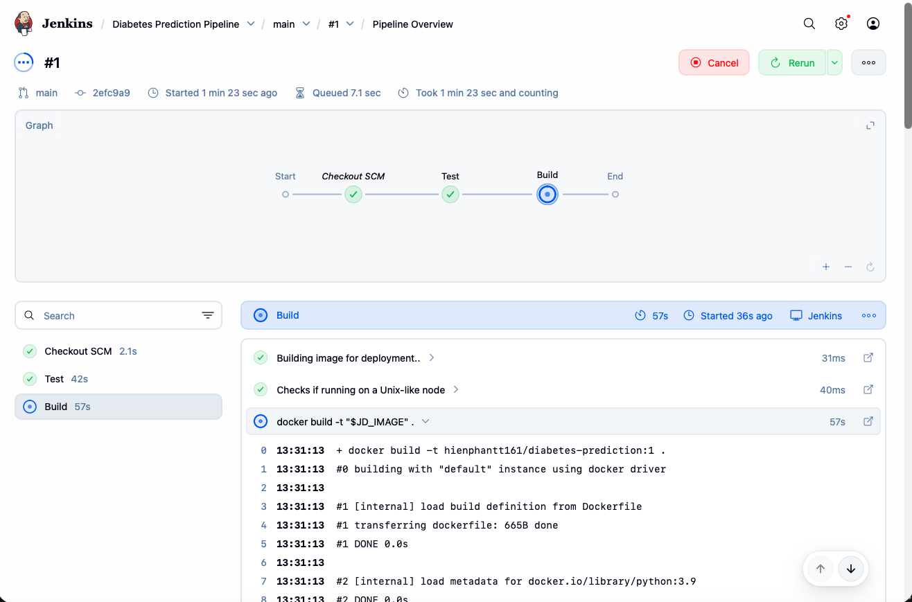
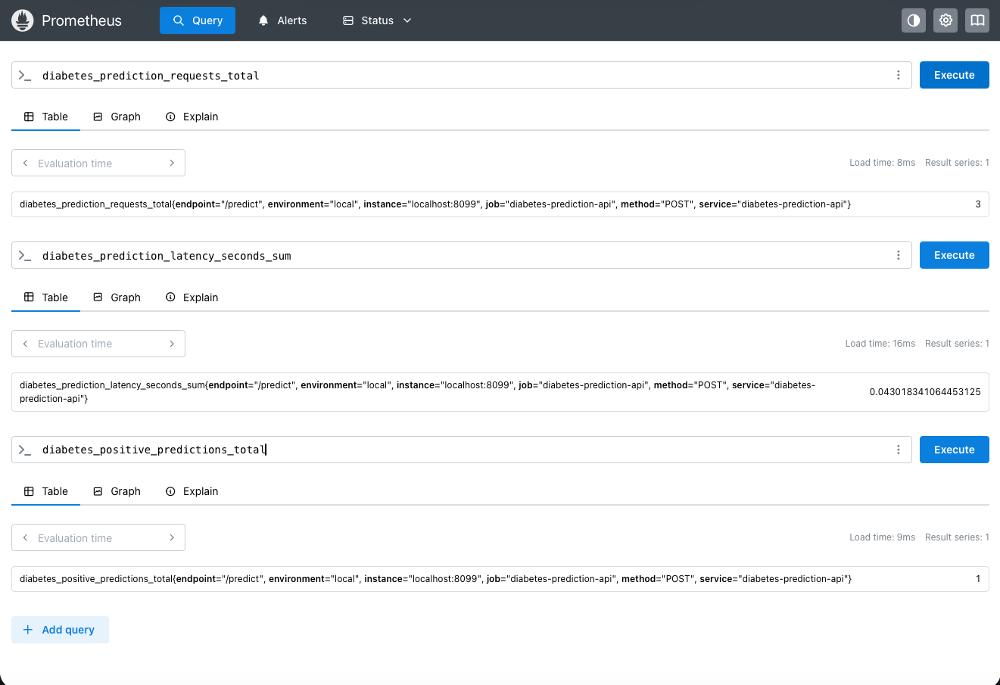
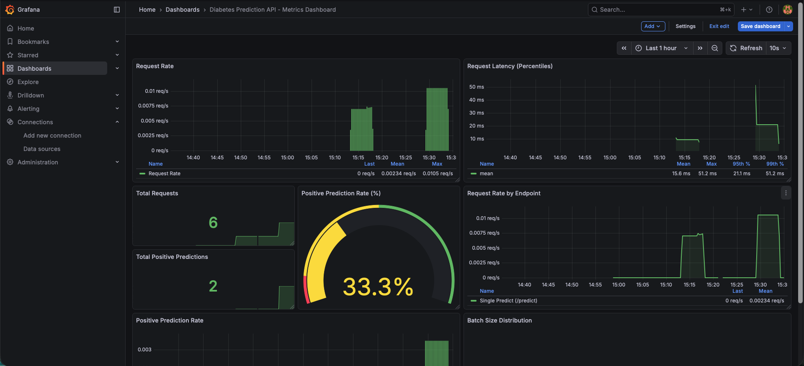

# Diabetes Prediction - MLOps Pipeline

Production-grade MLOps project demonstrating end-to-end machine learning operations: from model training to deployment with CI/CD, monitoring, and Kubernetes orchestration.

## 🎯 Overview

- **Model**: XGBoost achieving **97.23% accuracy** (F1: 80.88%, ROC-AUC: 97.95%)
- **Dataset**: 100,000 records, 27 engineered features
- **MLOps Stack**: MLflow, Docker, Kubernetes, Helm, Jenkins, Prometheus, Grafana, NGINX, Terraform, Ansible

## 📊 Results

| Metric | Value |
|--------|-------|
| Accuracy | 97.23% |
| Precision | 97.83% |
| Recall | 68.94% |
| F1-Score | 80.88% |
| ROC-AUC | 97.95% |

**Best Model**: XGBoost (n_estimators=100, max_depth=5, learning_rate=0.1)

## 🏗️ MLOps Architecture

```
┌─────────────────────────────────────────────────────────────────┐
│                    DEVELOPMENT & CI/CD                          │
├─────────────────────────────────────────────────────────────────┤
│                                                                 │
│  ┌─────────────┐     ┌──────────────┐     ┌─────────────┐       │
│  │  Training   │────▶│  MLflow      │────▶│   Docker    │       │
│  │  Pipeline   │     │  Tracking    │     │   Image     │       │
│  └─────────────┘     └──────────────┘     └──────┬──────┘       │
│                                                  │              │
│                                          ┌───────▼────────┐     │
│                                          │    Jenkins     │     │
│                                          │   CI/CD Pipe   │     │
│                                          └───────┬────────┘     │
│                                                  │              │
└──────────────────────────────────────────────────┼──────────────┘
                                                   │
┌──────────────────────────────────────────────────▼──────────────┐
│                    PRODUCTION DEPLOYMENT                        │
├─────────────────────────────────────────────────────────────────┤
│                                                                 │
│         ┌──────────────────────────────────────┐                │
│         │      External Traffic (Users)        │                │
│         └─────────────────┬────────────────────┘                │
│                           │                                     │
│                    ┌──────▼───────┐                             │
│                    │    NGINX     │                             │
│                    │   Ingress    │                             │
│                    └──────┬───────┘                             │
│                           │                                     │
│            ┌──────────────▼──────────────┐                      │
│            │      Kubernetes (Helm)      │                      │
│            │  ┌────────────────────────┐ │                      │
│            │  │   FastAPI Pods         │ │                      │
│            │  │   (Model Serving)      │ │                      │
│            │  └───────────┬────────────┘ │                      │
│            └──────────────┼──────────────┘                      │
│                           │                                     │
│                           │ (exposes metrics)                   │
│                           │                                     │
└───────────────────────────┼─────────────────────────────────────┘
                            │
          ┌─────────────────▼─────────────────┐
          │             Prometheus            │
          │          (Scrapes Metrics)        │
          └─────────────────┬─────────────────┘
                            │
                            │ (queries)
                            │
                  ┌─────────▼─────────┐
                  │      Grafana      │
                  │    (Visualizes)   │
                  └───────────────────┘
```

## 🛠️ MLOps Components

### 1. Experiment Tracking (MLflow)
- **Model Versioning**: Track 12 models × 8 preprocessors = 96 combinations
- **Artifact Management**: Model artifacts, parameters, metrics
- **Run Comparison**: Compare hyperparameters and performance metrics
- **Model Registry**: Best model identification and promotion



### 2. Model Serving (FastAPI)
- **RESTful API**: `/predict` (single), `/predict/batch` (batch)
- **Type Safety**: Pydantic models for validation
- **Auto Documentation**: OpenAPI/Swagger UI
- **Health Checks**: `/` and `/model/info` endpoints



### 3. Containerization (Docker)
- **Optimized Image**: Multi-stage builds, minimal dependencies
- **Port Separation**: API (30000), Metrics (8099)
- **Environment Config**: Configurable via env vars

```bash
docker build -t diabetes-prediction-api .
docker run -p 30000:30000 -p 8099:8099 diabetes-prediction-api
```

### 4. CI/CD Pipeline (Jenkins)
**Pipeline Stages**:
1. **Test**: Automated unit tests (pytest)
2. **Build**: Docker image build and push to registry
3. **Deploy**: Helm-based Kubernetes deployment



**Helm Integration**:
- Uses Helm container in Kubernetes agent
- `helm upgrade --install` for rolling deployments
- Automatic namespace creation
- Version management via Helm releases

```groovy
// Jenkinsfile stages
stage('Test') → stage('Build') → stage('Deploy')
// Deploy stage uses Helm for K8s deployment
container('helm') {
    sh("helm upgrade --install diabetes-prediction ./infra/helm_charts --namespace model-serving --create-namespace")
}
```

### 5. Monitoring & Observability
**OpenTelemetry + Prometheus**:
- `diabetes_prediction_requests_total` (Counter)
- `diabetes_prediction_latency_seconds` (Histogram)
- `diabetes_positive_predictions_total` (Counter)
- `diabetes_prediction_batch_size` (Histogram)



**Grafana Dashboards**:
- **Custom ML Metrics Dashboard** (`infra/prometheus/grafana-dashboard.json`)
  - Request rate visualization (requests/second)
  - Latency histograms and percentiles
  - Positive prediction counts
  - Batch size distributions
  - Real-time metric panels with Prometheus queries
- **Prometheus Integration**: Direct datasource connection
- **Deployment**: Via kube-prometheus-stack Helm chart
- **Features**: Auto-provisioning, dashboard discovery, alerting support



### 6. Infrastructure as Code
- **Terraform**: GCP GKE cluster provisioning
- **Helm Charts**: Kubernetes application packaging and deployment
  - Deployment manifests (multi-replica, rolling updates)
  - Service definitions (NodePort for API and metrics)
  - Configurable values (image tags, replicas, ports)
  - Automated deployment via CI/CD pipeline
- **NGINX Ingress Controller**: Kubernetes ingress for external access
  - Path-based routing to API endpoints (`/predict`, `/docs`, `/model/info`, `/metrics`)
  - Host-based routing (`diabetes-prediction.example.com`)
  - SSL/TLS termination support
  - Load balancing and traffic management
- **Ansible**: Configuration management and automation
  - Instance provisioning (GCP Compute Engine)
  - Jenkins deployment automation
  - Docker installation and setup
  - Firewall rules configuration

```bash
# Run Ansible playbooks
ansible-playbook -i infra/ansible/playbooks/create_instance.yaml
ansible-playbook -i inventory infra/ansible/playbooks/deploy_jenkins.yaml

# Deploy with Helm (also used in CI/CD pipeline)
helm upgrade --install diabetes-prediction ./infra/helm_charts \
  --namespace model-serving --create-namespace
```

## 🚀 Quick Start

### Local Development

```bash
# Install dependencies
pip install -r requirements.txt

# Train model
python src/training/train.py

# Run API
uvicorn src.api.main:app --reload --port 8000
```

### Docker Deployment

```bash
# Build and run
docker build -t diabetes-prediction-api .
docker run -p 30000:30000 -p 8099:8099 diabetes-prediction-api

# Test API
curl -X POST http://localhost:30000/predict \
  -H "Content-Type: application/json" \
  -d '{
    "gender": "Female",
    "age": 45.0,
    "hypertension": 0,
    "heart_disease": 0,
    "smoking_history": "never",
    "bmi": 27.5,
    "HbA1c_level": 6.2,
    "blood_glucose_level": 140
  }'
```

### Kubernetes Deployment

```bash
# Deploy with Helm (includes NGINX Ingress)
helm upgrade --install diabetes-prediction ./infra/helm_charts \
  --namespace model-serving --create-namespace

# Access API via NGINX Ingress
# Configure DNS: diabetes-prediction.example.com → Ingress IP
# Or use port-forward: kubectl port-forward -n ingress-nginx svc/ingress-nginx-controller 80:80
```

## 📡 API Endpoints

| Method | Endpoint | Description |
|--------|----------|-------------|
| GET | `/` | Health check |
| GET | `/model/info` | Model metadata |
| POST | `/predict` | Single prediction |
| POST | `/predict/batch` | Batch predictions |
| GET | `/metrics` | Prometheus metrics |
| GET | `/docs` | Swagger UI |

## 📁 Project Structure

```
diabetes-prediction/
├── src/
│   ├── training/train.py      # MLflow training
│   ├── api/main.py            # FastAPI serving
│   └── utils.py               # Shared utilities
├── tests/test_model.py        # Unit tests
├── infra/
│   ├── terraform/             # GCP infrastructure (IaC)
│   ├── ansible/               # Configuration management
│   │   ├── inventory          # Host inventory
│   │   └── playbooks/         # Ansible playbooks
│   ├── helm_charts/           # Helm charts for K8s
│   │   ├── Chart.yaml         # Chart metadata
│   │   ├── values.yaml        # Configuration values
│   │   └── templates/         # K8s manifests
│   │       ├── deployment.yaml
│   │       ├── service.yaml
│   │       └── ingress-nginx.yaml  # NGINX Ingress configuration
│   └── prometheus/            # Monitoring stack
│       ├── grafana-dashboard.json  # Custom Grafana dashboard
│       ├── kube-prometheus-stack/  # Prometheus + Grafana stack
│       └── values-prometheus.yaml  # Stack configuration
├── Dockerfile                 # Container image
├── Jenkinsfile               # CI/CD pipeline
└── results/
    ├── 4_best_model/         # Production model
    └── mlruns/               # MLflow tracking
```

## 🎓 MLOps Skills Demonstrated

- ✅ **Experiment Tracking**: MLflow for model versioning and comparison
- ✅ **Model Serving**: FastAPI REST API with type safety
- ✅ **Containerization**: Docker for reproducible deployments
- ✅ **CI/CD**: Jenkins pipeline with automated testing and deployment
- ✅ **Monitoring**: OpenTelemetry + Prometheus metrics collection
- ✅ **Visualization**: Grafana dashboards for real-time metrics visualization
- ✅ **Infrastructure**: Terraform for cloud provisioning
- ✅ **Configuration Management**: Ansible for automation and setup
- ✅ **Kubernetes Orchestration**: Helm for package management and deployment
- ✅ **Ingress & Load Balancing**: NGINX Ingress Controller for external access

## 📚 Key Technologies

- **ML**: scikit-learn, xgboost, lightgbm
- **MLOps**: MLflow, Docker, Kubernetes
- **API**: FastAPI, uvicorn, pydantic
- **Monitoring**: OpenTelemetry (instrumentation), Prometheus (metrics), Grafana (visualization)
- **Infrastructure**: Terraform (IaC), Helm (K8s package manager), Ansible (config mgmt), Jenkins (CI/CD)
- **Ingress**: NGINX Ingress Controller (routing, load balancing, SSL/TLS)
- **Cloud**: Google Cloud Platform (GKE)