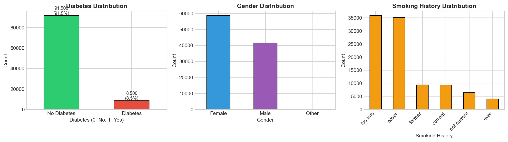
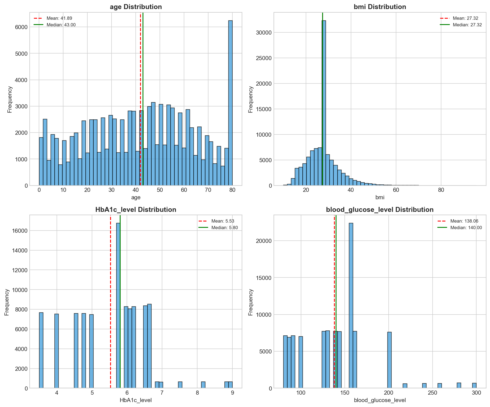
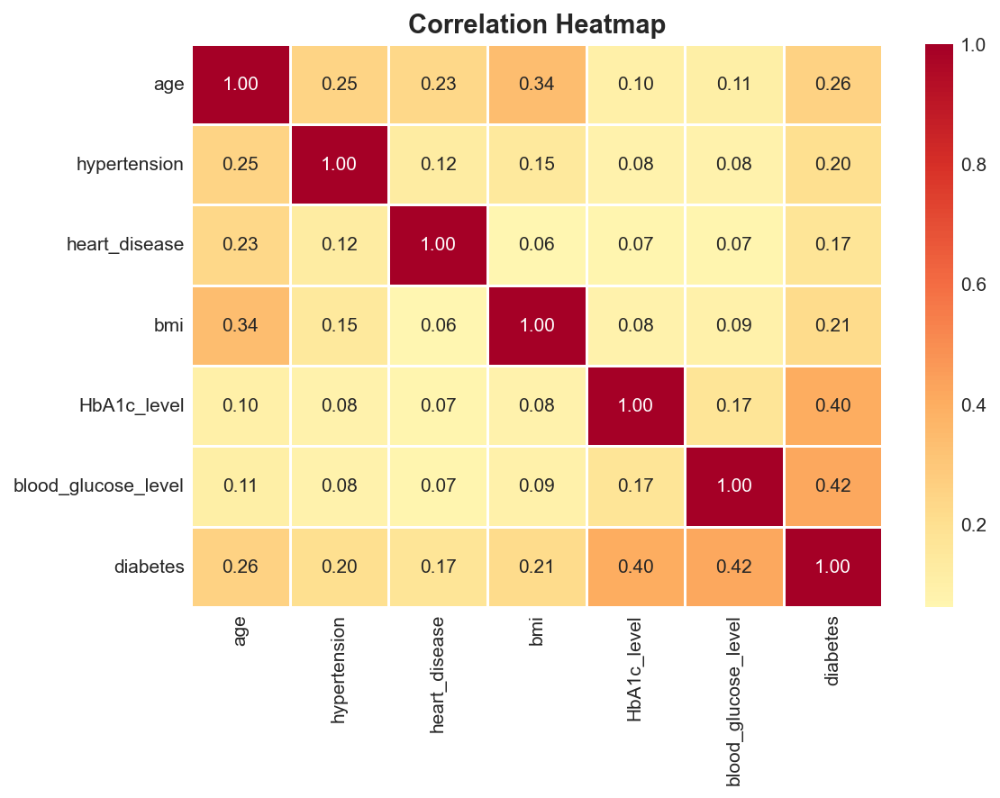
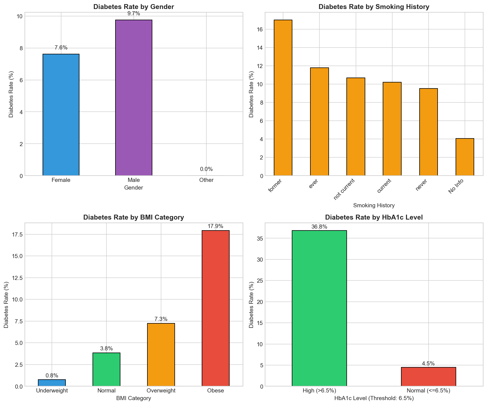

# 1: Basic EDA Analysis Report

## Dataset Overview

- **Total Records**: 100,000 patients
- **Total Features**: 8 predictors + 1 target
- **Target Variable**: diabetes (0 = No, 1 = Yes)

---

## 1. Target Variable Distribution

### Key Findings

| Class | Count | Percentage |
|-------|-------|------------|
| No Diabetes (0) | 91,500 | 91.5% |
| Diabetes (1) | 8,500 | 8.5% |

**Class Imbalance Ratio: 10.76:1**

This severe class imbalance is important for modeling. We'll need to consider:
- Stratified sampling during train/test split
- Class weights or resampling techniques (SMOTE, undersampling)
- Appropriate evaluation metrics (F1-score, AUC-ROC, Precision-Recall)

---

## 2. Gender Distribution

| Gender | Count |
|--------|-------|
| Female | ~58,000 |
| Male | ~42,000 |
| Other | Very few |

**Diabetes Rate by Gender:**
- Male: **9.7%** - slightly higher risk
- Female: **7.6%**
- Other: **0.0%** (insufficient data)

---

## 3. Smoking History Distribution

The dataset has 6 smoking categories with "No Info" being the most common (~35,800 records).

**Diabetes Rate by Smoking History (sorted by risk):**

| Smoking Status | Diabetes Rate |
|----------------|---------------|
| Former | **17.0%** (highest risk) |
| Ever | ~11.7% |
| Not Current | ~10.3% |
| Current | ~9.9% |
| Never | ~9.5% |
| No Info | **4.1%** (lowest - likely younger patients) |

**Insight**: Former smokers have the highest diabetes rate, suggesting long-term health impacts of past smoking.

---

## 4. Numerical Feature Distributions

### Age Distribution
- **Range**: 0-80 years
- **Mean**: 41.89 years
- **Median**: 43.00 years
- **Shape**: Relatively uniform with a spike at 80 (likely capped maximum)

### BMI Distribution
- **Range**: 10.01 - 95.69
- **Mean/Median**: 27.32 (overweight category)
- **Shape**: Right-skewed with most values between 20-35

**BMI Categories:**
| Category | Range | Count | Diabetes Rate |
|----------|-------|-------|---------------|
| Underweight | <18.5 | 8,521 | 0.8% |
| Normal | 18.5-24.9 | 21,831 | 3.8% |
| Overweight | 25-29.9 | 45,767 | 7.3% |
| Obese | >=30 | 23,881 | **17.9%** |

### HbA1c Level Distribution
- **Range**: 3.5 - 9.0
- **Mean**: 5.53
- **Median**: 5.80
- **Clinical threshold**: >6.5% indicates diabetes

**HbA1c Categories:**
| Level | Count | Diabetes Rate |
|-------|-------|---------------|
| Normal (<=6.5%) | 87,565 (87.6%) | 4.5% |
| High (>6.5%) | 12,435 (12.4%) | **36.8%** |

### Blood Glucose Level Distribution
- **Range**: 80 - 300
- **Mean**: 138.06
- **Median**: 140.00
- **Shape**: Multi-modal distribution with peaks around 80, 130-160, and 200

---

## 5. Correlation Analysis

### Correlations with Diabetes (ranked):

| Feature | Correlation | Interpretation |
|---------|-------------|----------------|
| blood_glucose_level | **0.42** | Strong positive - primary indicator |
| HbA1c_level | **0.40** | Strong positive - key diagnostic marker |
| age | 0.26 | Moderate positive - risk increases with age |
| bmi | 0.21 | Moderate positive - obesity linked to diabetes |
| hypertension | 0.20 | Weak positive - comorbidity factor |
| heart_disease | 0.17 | Weak positive - comorbidity factor |

### Notable Feature Correlations:
- **age-bmi**: 0.34 (BMI tends to increase with age)
- **age-hypertension**: 0.25 (older patients more likely to have hypertension)
- **age-heart_disease**: 0.23 (cardiovascular risk increases with age)
- **HbA1c-blood_glucose**: 0.17 (both blood sugar related)

---

## 6. Diabetes Rate by Category

### Key Risk Factors Identified:

1. **HbA1c > 6.5%**: 36.8% diabetes rate (8x higher than normal)
2. **Obese BMI**: 17.9% diabetes rate (highest among BMI groups)
3. **Former Smokers**: 17.0% diabetes rate
4. **Male Gender**: 9.7% vs 7.6% for females

---

## 7. Data Quality Summary

| Issue | Status |
|-------|--------|
| Missing Values | None (0) |
| "No Info" in smoking_history | 35,816 (35.82%) |

**Note**: The high percentage of "No Info" in smoking history may need special handling during preprocessing (encoding as a separate category or imputation).

---

## Summary for Modeling

### Top Predictive Features (by correlation):
1. blood_glucose_level (0.42)
2. HbA1c_level (0.40)
3. age (0.26)
4. bmi (0.21)

### Challenges to Address:
1. **Class imbalance** (10.76:1 ratio) - needs resampling or weighted models
2. **"No Info" smoking data** (35.8%) - categorical encoding strategy needed
3. **BMI outliers** - possible extreme values >70

### Recommended Next Steps:
1. Feature engineering (age groups, BMI categories, HbA1c threshold flag)
2. Handle class imbalance with SMOTE or class weights
3. Encode categorical variables appropriately
4. Consider ensemble methods for robust predictions

