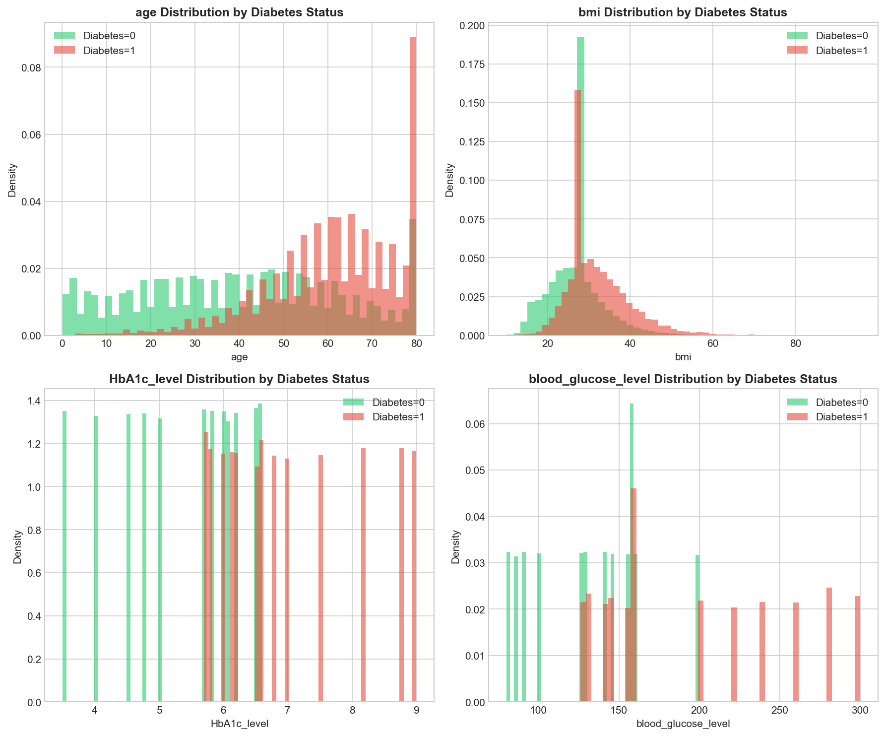
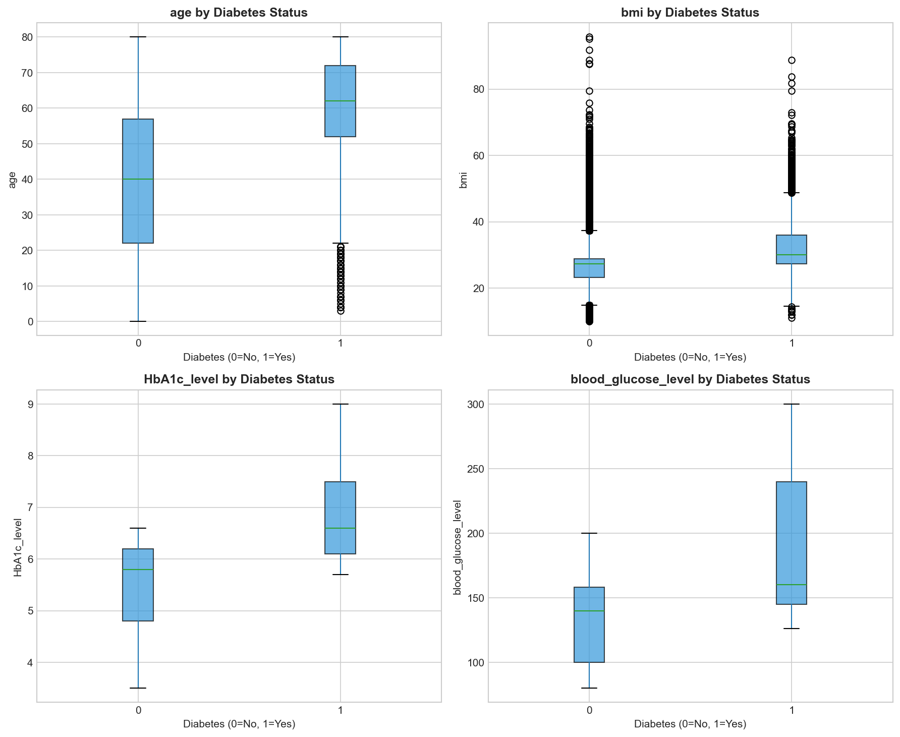
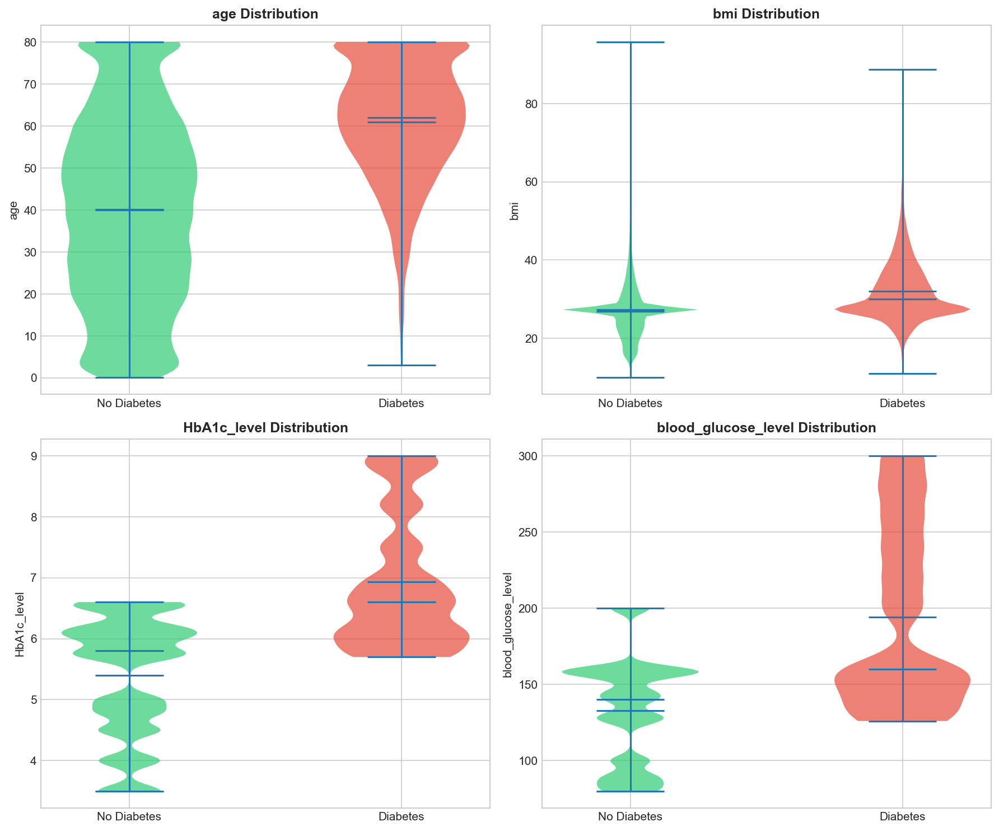
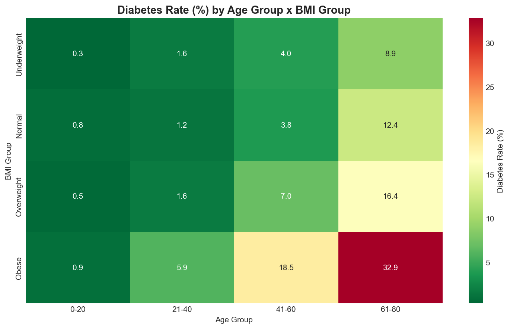
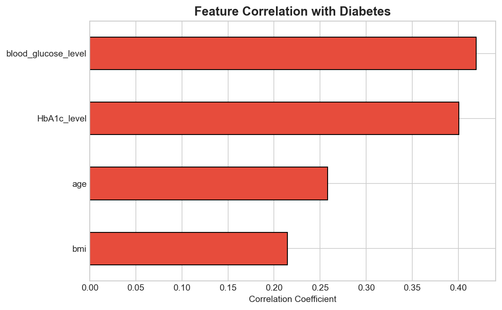
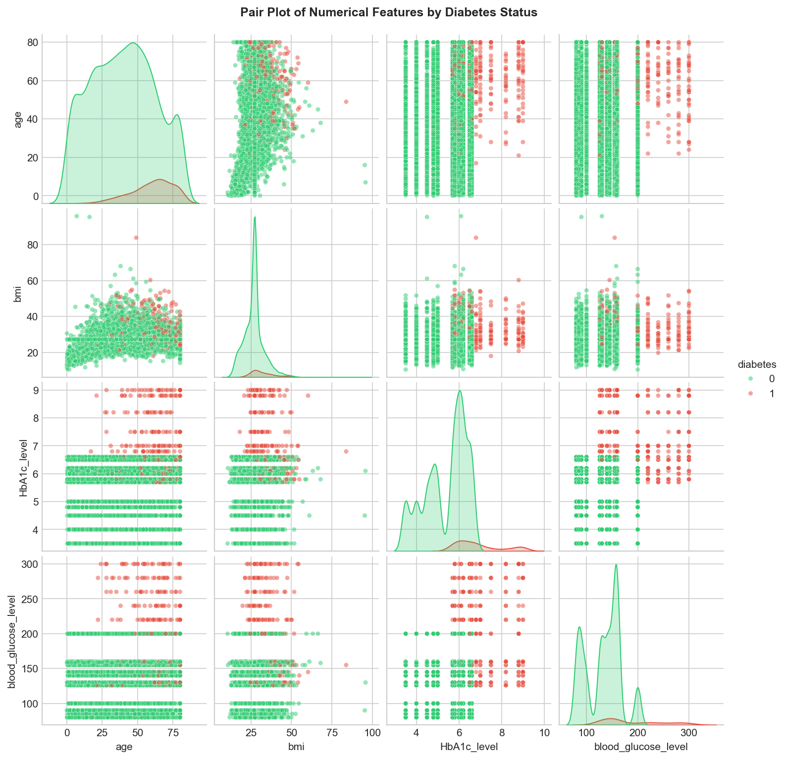

# 2: Advanced EDA Analysis Report

## 1. Statistical Significance Testing

### Chi-Square Tests (Categorical Features)

All categorical features show **statistically significant** relationships with diabetes (p < 0.05):

| Feature | Chi-Square | p-value | Significance |
|---------|------------|---------|--------------|
| smoking_history | 1956.09 | 0.00 | Highly significant |
| hypertension | 3910.71 | 0.00 | Highly significant |
| heart_disease | 2945.85 | 0.00 | Highly significant |
| gender | 143.22 | 7.95e-32 | Significant |

**Interpretation**: The extremely low p-values indicate that the distribution of diabetes is NOT independent of these categorical variables. Hypertension shows the strongest association.

### T-Tests (Numerical Features)

All numerical features show **significant differences** between diabetic and non-diabetic groups:

| Feature | t-statistic | p-value | Cohen's d |
|---------|-------------|---------|-----------|
| blood_glucose_level | -146.16 | 0.0 | **1.50** (very large) |
| HbA1c_level | -138.28 | 0.0 | **1.44** (very large) |
| age | -84.45 | 0.0 | **0.93** (large) |
| bmi | -69.40 | 0.0 | **0.77** (medium-large) |

**Cohen's d Interpretation**:
- 0.2 = small effect
- 0.5 = medium effect
- 0.8 = large effect
- >1.0 = very large effect

**Key Insight**: Blood glucose and HbA1c have very large effect sizes (>1.4), making them the most discriminative features for predicting diabetes.

---

## 2. Distribution Comparison by Diabetes Status

### Age Distribution
- **No Diabetes**: Broader distribution across all ages, peak at 0-10 years
- **Diabetes**: Concentrated in older ages (50-80), very few young diabetics
- **Clear separation**: Diabetic patients are significantly older

### BMI Distribution
- **No Diabetes**: Sharp peak around 27 (overweight)
- **Diabetes**: Flatter distribution, shifted toward higher BMI
- **Overlap**: Considerable overlap, but diabetics tend toward higher BMI

### HbA1c Level Distribution
- **No Diabetes**: Concentrated at lower values (3.5-6.5)
- **Diabetes**: Shifted right, concentrated at 6.0-9.0
- **Critical observation**: Values >6.5 are strong diabetes indicators

### Blood Glucose Level Distribution
- **No Diabetes**: Peak around 140, mostly <200
- **Diabetes**: More spread out, higher frequency at 200-300
- **Best discriminator**: Most visible separation between groups

---

## 3. Box Plot Analysis

### Key Observations:

| Feature | No Diabetes (Median) | Diabetes (Median) | Difference |
|---------|---------------------|-------------------|------------|
| Age | ~40 years | ~60 years | +20 years |
| BMI | ~25 | ~30 | +5 units |
| HbA1c | ~5.8 | ~6.6 | +0.8 |
| Blood Glucose | ~140 | ~160 | +20 |

**Outliers**:
- BMI has significant outliers (>60) in both groups
- Blood glucose shows outliers up to 300 in diabetics

---

## 4. Violin Plot Analysis

### Distribution Shape Insights:

**Age**:
- Non-diabetics: Uniform distribution across all ages
- Diabetics: Concentrated between 50-80, tapers off for younger ages
- Almost no diabetics under age 20

**BMI**:
- Both groups show similar peak around 27
- Diabetics have a wider "bulge" in the 30-40 range (obesity)
- Long tail of outliers in both groups

**HbA1c Level**:
- Non-diabetics: Multi-modal with peaks at discrete values (3.5, 4.0, etc.)
- Diabetics: Concentrated around 6.5-7.5 with extension to 9.0
- Clear visual separation above 6.5%

**Blood Glucose**:
- Non-diabetics: Concentrated at lower glucose levels
- Diabetics: More uniform spread with significant presence at 200-300

---

## 5. Feature Interaction Heatmap (Age x BMI)

### Diabetes Rate by Age Group x BMI Category:

| BMI \ Age | 0-20 | 21-40 | 41-60 | 61-80 |
|-----------|------|-------|-------|-------|
| Underweight | 0.3% | 1.6% | 4.0% | 8.9% |
| Normal | 0.8% | 1.2% | 3.8% | 12.4% |
| Overweight | 0.5% | 1.6% | 7.0% | 16.4% |
| **Obese** | 0.9% | 5.9% | 18.5% | **32.9%** |

### Key Findings:
1. **Highest risk group**: Obese patients aged 61-80 have **32.9% diabetes rate**
2. **Age is crucial**: Even underweight elderly (8.9%) have higher rates than obese youth (0.9%)
3. **Compounding effect**: Age and BMI interact multiplicatively - obese elderly risk is 100x higher than underweight youth
4. **Low-risk groups**: All BMI categories under age 20 have <1% diabetes rate

---

## 6. Feature Correlation with Diabetes

### Ranked Feature Importance (by correlation):

1. **blood_glucose_level**: 0.42 - Strongest predictor
2. **HbA1c_level**: 0.40 - Second strongest
3. **age**: 0.26 - Moderate predictor
4. **bmi**: 0.21 - Moderate predictor

All features show positive correlation with diabetes, confirming medical knowledge that higher values increase risk.

---

## 7. Pair Plot Analysis

### Observations from Scatter Plots:

**Age vs BMI**:
- Diabetics (red) cluster in upper-right (older, higher BMI)
- Non-diabetics (green) spread across all combinations
- Young patients with any BMI rarely have diabetes

**Age vs HbA1c**:
- Diabetics concentrate at higher HbA1c regardless of age
- Clear horizontal separation above HbA1c ~6.5

**Age vs Blood Glucose**:
- Diabetics visible at higher glucose levels (>200)
- Older diabetics spread across all glucose levels

**BMI vs HbA1c**:
- No strong linear relationship
- Diabetics appear at all BMI levels but higher HbA1c

**Blood Glucose vs HbA1c**:
- Moderate positive correlation visible
- Diabetics cluster at high values of both

---

## 8. Hypertension x Heart Disease Interaction

### Diabetes Rate by Comorbidity:

| Hypertension | Heart Disease | Diabetes Rate | Count |
|--------------|---------------|---------------|-------|
| No | No | 6.1% | 89,489 |
| No | Yes | 30.0% | 3,026 |
| Yes | No | 26.3% | 6,569 |
| **Yes** | **Yes** | **39.1%** | 916 |

### Key Findings:
1. **Baseline risk** (no conditions): 6.1%
2. **Heart disease alone**: 30.0% (5x increase)
3. **Hypertension alone**: 26.3% (4x increase)
4. **Both conditions**: 39.1% (6.4x increase)

**Clinical implication**: Patients with both hypertension and heart disease should be prioritized for diabetes screening.

---

## 9. Outlier Analysis (IQR Method)

| Feature | Outliers | Percentage | Acceptable Range |
|---------|----------|------------|------------------|
| age | 0 | 0.00% | Full range valid |
| bmi | 7,086 | 7.09% | Beyond normal bounds |
| HbA1c_level | 1,315 | 1.32% | Extreme values |
| blood_glucose_level | 2,038 | 2.04% | Very high readings |

**Recommendation**: BMI outliers (7%) may need investigation - could be data errors or genuinely extreme obesity cases.

---

## Summary: Key Insights for Modeling

### Most Predictive Features:
1. **blood_glucose_level** - Cohen's d = 1.50 (very large effect)
2. **HbA1c_level** - Cohen's d = 1.44 (very large effect)
3. **age** - Cohen's d = 0.93 (large effect)
4. **bmi** - Cohen's d = 0.77 (medium-large effect)

### Feature Engineering Opportunities:
1. Create **age groups** (0-20, 21-40, 41-60, 61-80)
2. Create **BMI categories** (Underweight, Normal, Overweight, Obese)
3. Create **HbA1c flag** (>6.5% indicator)
4. Create **comorbidity score** (hypertension + heart_disease)
5. Consider **age x BMI interaction** term

### High-Risk Patient Profile:
- Age: 60+ years
- BMI: 30+ (Obese)
- HbA1c: >6.5%
- Blood glucose: >200
- Has hypertension and/or heart disease
- Former smoker

### Modeling Recommendations:
1. Use **stratified k-fold** due to class imbalance
2. Consider **tree-based models** (can capture age x BMI interaction naturally)
3. Focus on **precision-recall** metrics rather than accuracy
4. Test **ensemble methods** for robust predictions

